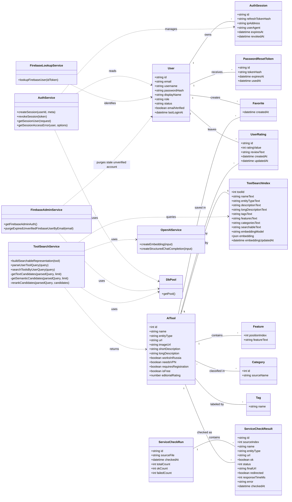

# Диаграмма классов

Ниже приведена UML-диаграмма классов для текущей версии проекта. Она отражает не только основные предметные сущности каталога, но и сервисные классы, которые реально участвуют в авторизации, поиске, проверке доступности и работе с индексом.

## Что показывает эта диаграмма

- `AITool` — центральный класс системы, описывающий карточку нейросети или полезного сайта.
- `Category`, `Tag`, `Feature` — связанные сущности, которые описывают классификацию и свойства инструмента.
- `User`, `AuthSession`, `PasswordResetToken`, `Favorite`, `UserRating` — блок пользовательского взаимодействия и авторизации.
- `ServiceCheckRun` и `ServiceCheckResult` — блок мониторинга доступности сайтов.
- `ToolSearchIndex` — поисковый индекс для обычного и умного поиска.
- `AuthService`, `FirebaseLookupService`, `FirebaseAdminService`, `ToolSearchService`, `OpenAIService` — сервисные классы, реализующие прикладную логику.

## Как это можно описать в тексте

Если тебе нужен кусок для пояснительной записки, можно написать так:

> Диаграмма классов отражает статическую структуру программной системы и показывает основные сущности каталога ИИ-инструментов, их атрибуты, операции и взаимосвязи. Центральным классом является `AITool`, связанный с категориями, тегами, функциональными характеристиками, пользовательскими оценками и избранным. Отдельную группу составляют классы пользовательского доступа и авторизации (`User`, `AuthSession`, `PasswordResetToken`), а также сервисные классы, обеспечивающие работу поиска, Firebase-аутентификации, управления сессиями и индексации данных. Таким образом, диаграмма описывает логическое устройство системы и показывает взаимодействие предметной модели с прикладными сервисами.
