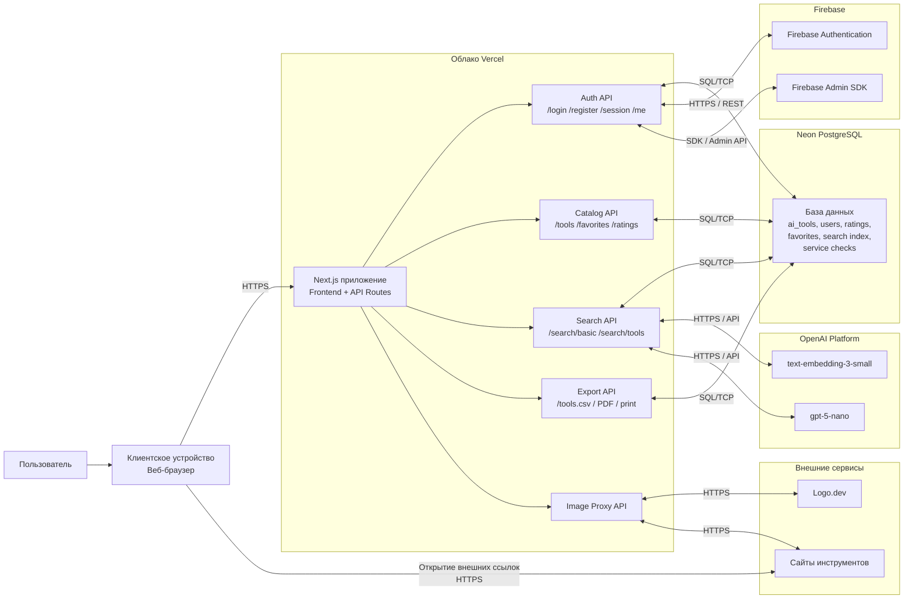

# Диаграмма развёртывания

Ниже приведена UML-диаграмма развёртывания для текущей архитектуры проекта. Она показывает, где физически или логически размещаются основные компоненты системы и как они взаимодействуют между собой.

## Что показывает эта диаграмма

- Пользователь работает с системой через браузер на клиентском устройстве.
- Основное веб-приложение развёрнуто в `Vercel` и включает как интерфейс, так и серверные `API Routes`.
- Данные каталога, пользователей, оценок, избранного и поискового индекса хранятся во внешней базе `Neon PostgreSQL`.
- Авторизация через email/пароль и Google-вход реализуются через `Firebase Authentication`.
- Серверная часть использует `Firebase Admin SDK` для служебных операций, связанных с аккаунтами.
- Умный поиск использует внешние модели `OpenAI`: embeddings для семантического поиска и chat model для rerank.
- Загрузка внешних изображений и логотипов проходит через прокси-слой приложения, который обращается к `Logo.dev` и к сайтам самих инструментов.

## Как это можно описать в тексте

Если тебе нужен готовый абзац для пояснительной записки, можно использовать такой вариант:

> Диаграмма развёртывания отражает структуру размещения программной системы и взаимодействие её компонентов в рабочей среде. Клиентская часть функционирует в веб-браузере пользователя, который по протоколу HTTPS обращается к приложению, развёрнутому в облачной среде Vercel. Серверная часть приложения включает пользовательский интерфейс и набор API-маршрутов, обеспечивающих авторизацию, работу с каталогом, поиском, экспортом и проксированием изображений. Хранение основной информации реализовано во внешней базе данных Neon PostgreSQL. Для аутентификации пользователей используется Firebase Authentication, а для административных операций с учётными записями — Firebase Admin SDK. Подсистема интеллектуального поиска взаимодействует с внешней платформой OpenAI, используя модель эмбеддингов для семантического поиска и языковую модель для дополнительного ранжирования результатов. Таким образом, диаграмма развёртывания показывает распределение компонентов системы по узлам и внешним сервисам, а также каналы их взаимодействия.

## Если нужен более академичный вариант

Можно упростить формулировку и написать так:

> Диаграмма развёртывания предназначена для отображения физической структуры программной системы, то есть размещения её компонентов на вычислительных узлах и во внешних сервисах. В рассматриваемой системе пользователь взаимодействует с веб-приложением через браузер. Основное приложение размещено в облачной среде Vercel, база данных — во внешнем сервере Neon PostgreSQL, подсистема аутентификации — в Firebase, а интеллектуальный поиск использует внешние сервисы OpenAI. Такая архитектура обеспечивает разделение клиентской части, серверной логики, хранилища данных и внешних интеллектуальных сервисов.
